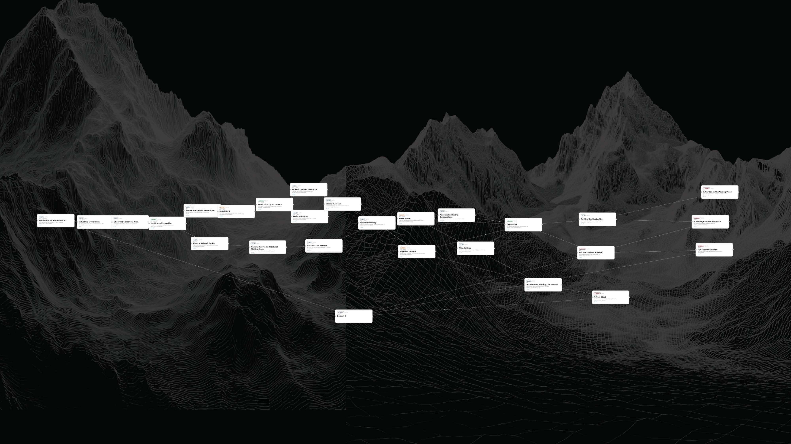
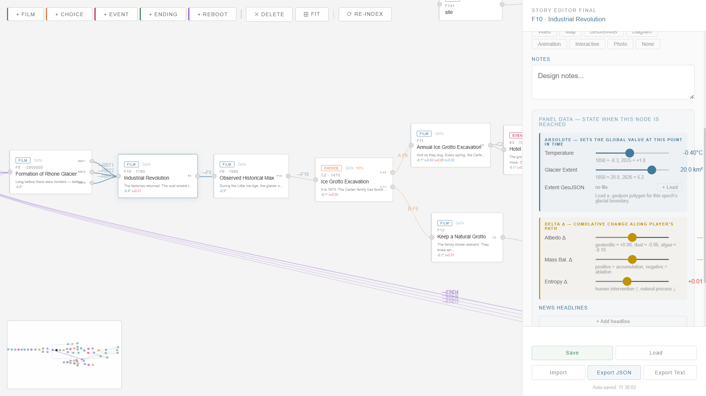
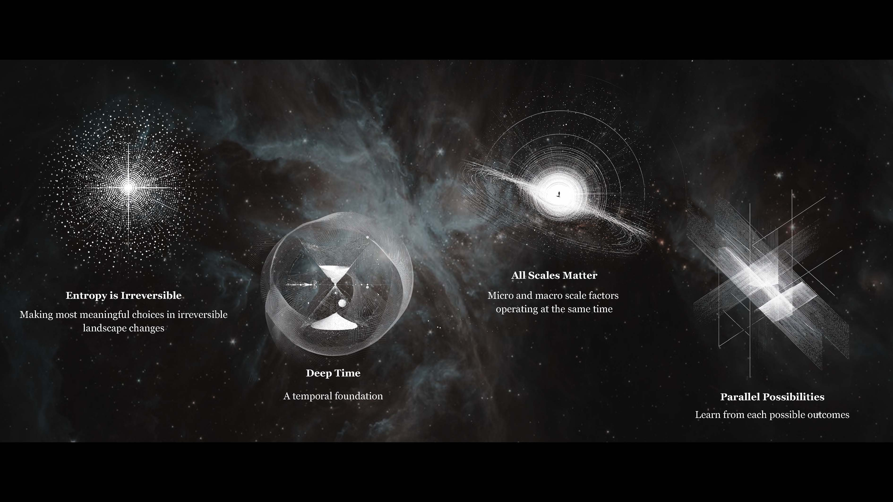
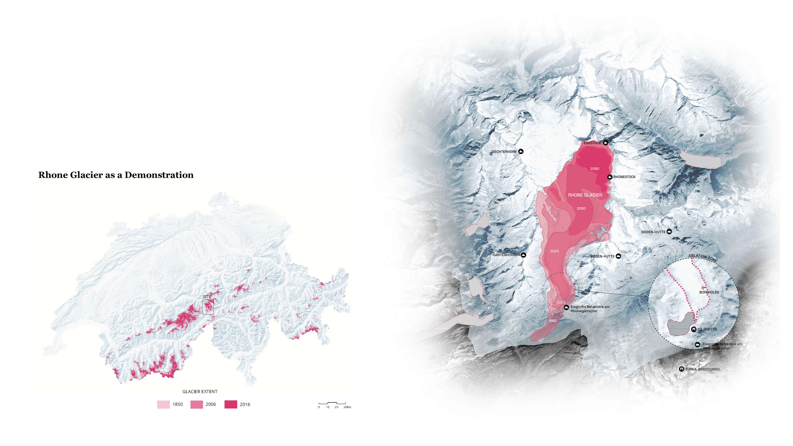

# The Story Editor

### A Representational Method for Landscape Indeterminacy

*Master of Landscape Architecture Thesis · University of British Columbia*

> Representation not as a finished output that fixes a single reading,
> but as a **substrate** — assemblable, transmissible, and open to continuation.

<!-- 主视觉图：上传到 images/ 后，把下面这行的路径改成你的图 -->

---

## Overview

Conventional landscape representation works as **output**: a finished artifact — a plan, a render, a section — that fixes one interpretation and closes the reading. *The Story Editor* reframes representation as **substrate**. Landscape is modeled as an event-network topology: **nodes** are events, **edges** are causal relations, and **parameters** carry observable data. The result is assemblable, transmissible, and open to continuation by others.

## The Problem

To represent uncertainty is, paradoxically, to make it certain — the moment an open future is drawn, it settles into a single fixed image. Traditional landscape media inherit this: they resolve indeterminacy into one authored result. This thesis asks whether representation can instead **hold indeterminacy open** — carrying plurality rather than collapsing it.

## The Instrument

*The Story Editor* is a visual editor for **event-network topologies**:

- **Nodes** — events
- **Edges** — causal relations between events
- **Parameters** — observable data carried by the network

<!-- 工具界面 / 图解：替换成你的图 -->

## Four Structural Features

- **Deep time** — A 2.5-million-year baseline weights events across every scale, so a single afternoon and an ice age can be read on the same ground.
- **Multi-scale interaction** — Micro, global, and continental events share one timeline, reconciled through parameter weights rather than separated into registers.
- **Irreversibility** — Entropy accumulates as the network grows; choices cannot be undone, which is what makes them mean something.
- **Parallel possibilities** — Branching subgraphs and a reboot mechanic make the plurality of futures something you can enter and compare, not just assert.

<!-- 工具界面 / 图解：替换成你的图 -->

## Demonstration — Rhône Glacier

The method is demonstrated on the **Rhône Glacier**, chosen as a vehicle rather than a subject.

<!-- 工具界面 / 图解：替换成你的图 -->

<!-- demo 视频封面：上传封面图到 images/，把链接换成你的 Vimeo/YouTube 地址 -->

---

**Qianqian Viola Zhao**
*Master of Landscape Architecture · University of British Columbia*
